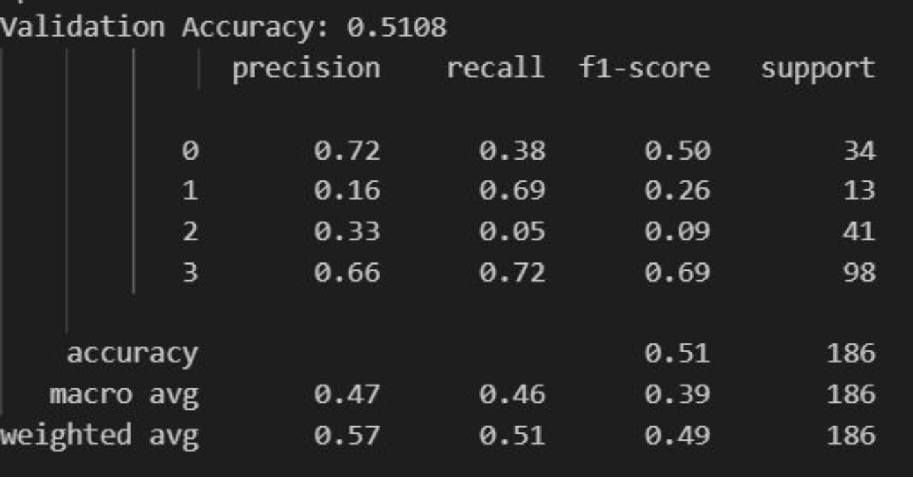
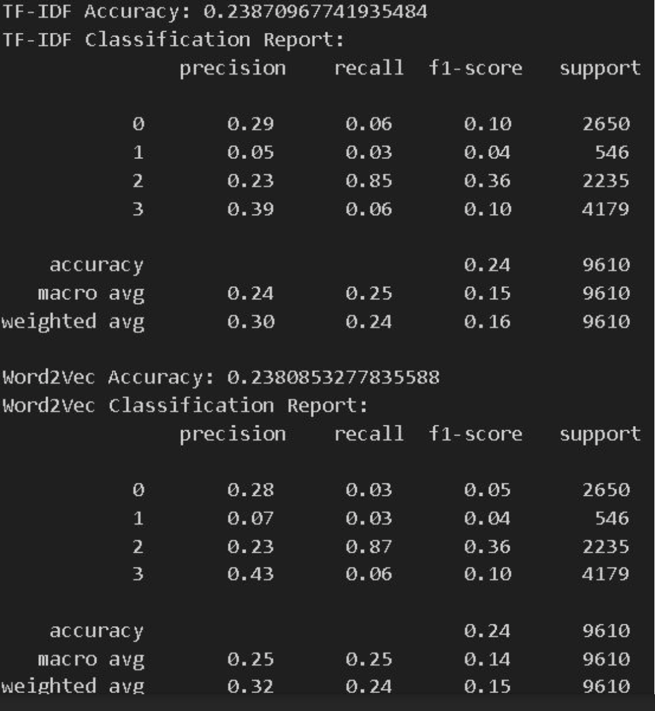

# Suicide Risk Classification Using NLP and Machine Learning

# Overview
Suicide prevention is a critical global challenge. Social media platforms, such as Reddit, contain valuable text data that can reveal indicators of emotional distress. This project aims to develop a multi-class classification model to predict suicide risk levels using Natural Language Processing (NLP) and Machine Learning (ML) techniques. The classification model assigns posts into risk categories (A–D) based on text content.

# Dataset
We utilized the UMD Reddit Suicidality Dataset, which consists of:
- 128 Crowd-sourced Labeled Posts
- 248 Expert-annotated Posts
- Labels range from A (high risk) to D (low risk)

# Project Pipeline
1. Data Preprocessing
- Cleaning text (removing stopwords, tokenization, lemmatization)
- Feature extraction using TF-IDF and Word2Vec
  
2. Baseline Model
- Implemented Random Forest Classifier as a baseline.
- Achieved an accuracy of 24% using TF-IDF and Word2Vec.

3. Fine-Tuned BERT Model
- Utilized HuggingFace bert_base_uncased with AdamW optimizer.
- Applied class weights and regularization to mitigate class imbalances.
- Achieved 51% validation accuracy, demonstrating the effectiveness of transformer-based models.

# Evaluation Metrics
We assessed model performance using:
- Weighted Accuracy
- Precision, Recall, and F1-score
- Cross-entropy loss with Softmax activation

# Challenges & Limitations
One of the main challenges we encountered was the limited size of the training dataset, which made it difficult for the model to generalize effectively. With only a few hundred labeled posts, the model lacked sufficient data to learn robust language patterns for suicide risk classification. Another issue was the class imbalance, as certain labels (e.g., B and C) had significantly fewer samples than others. This imbalance affected the precision and recall of those specific risk levels, making it harder for the model to make accurate predictions. Additionally, while BERT significantly improved accuracy, it also inherited biases from its pre-trained corpus, leading to cases where even neutral text was misclassified due to underlying language model biases. Addressing these challenges would require more extensive datasets, advanced augmentation techniques, and collaboration with domain experts to fine-tune the model for real-world applications.

# Conclusion
This project successfully demonstrated how text-based analysis can be used to classify suicide risk with promising accuracy. We found that feature engineering (e.g., TF-IDF, Word2Vec) and hyperparameter tuning played a crucial role in improving model performance. The fine-tuned BERT model outperformed traditional machine learning models, showcasing the power of transformer-based NLP techniques in mental health applications. However, the challenges of small datasets, class imbalances, and model biases indicate the need for further refinement and ethical considerations in AI-driven suicide risk assessment. Moving forward, collaboration with mental health professionals could help improve model interpretability and ensure responsible AI deployment in real-world scenarios.

# Technology Used
- Programming: Python (NumPy, Pandas, Scikit-learn)
- Machine Learning: TensorFlow, PyTorch, HuggingFace Transformers (BERT)
- NLP: TF-IDF, Word2Vec, Tokenization, Lemmatization
- Data Engineering: ETL Pipelines, NoSQL, Snowflake, Airflow
- Cloud & Big Data: AWS (S3, SageMaker, Lambda), Hadoop, Spark
- Visualization: Tableau, Matplotlib, Seaborn
